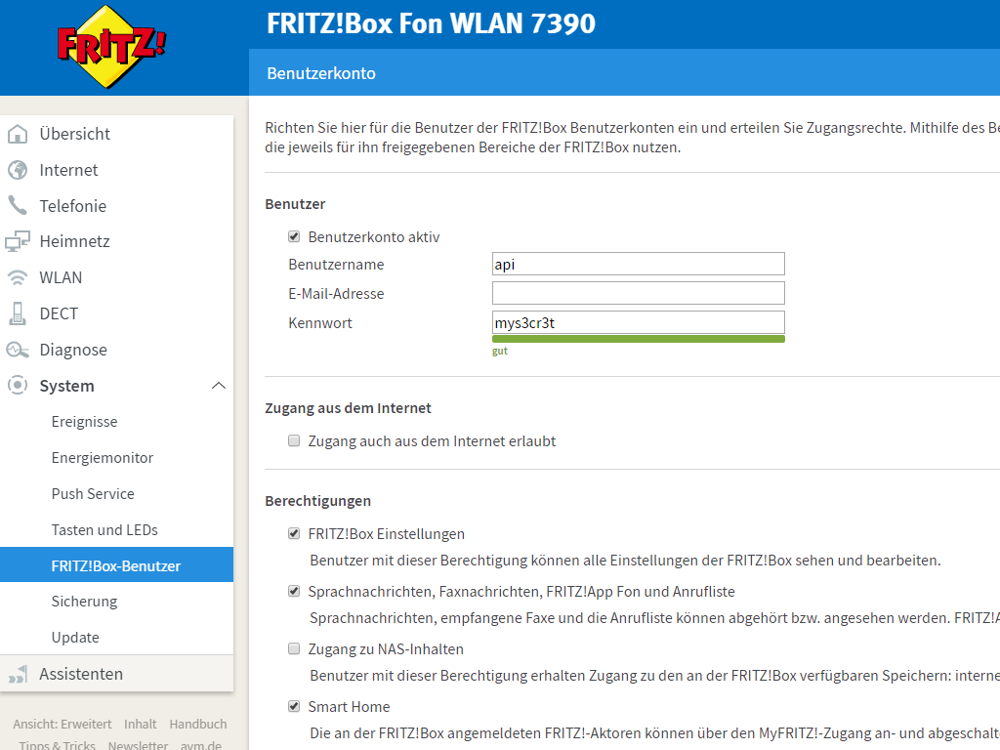

# node-red-contrib-fritzXSI
This project is based on the work from https://github.com/lesander/fritzbox.js
It has been simplified to only support the desired functionality of this project and made it available for use with node-red

## Summary
This node-red node gives access to the Fritz!Box internal call log and directory to devices supporting the XSI interface.

## Getting Started
Get the latest version (`^7.0.0`) of nodejs and node-red
```
npm -g install node-red
```

Install this package
```
git clone https://github.com/mailsvb/node-red-contrib-fritzXSI.git
cd node-red-contrib-fritzXSI && npm -g install .
```

## Configure node-red
Configure node-red to use https instead of default http and launch node-red. Check this tutorial: https://www.hardill.me.uk/wordpress/2015/05/11/securing-node-red/
```
node-red
```

Prepare a simple flow. You need an HTTP input node and connect it to the Fritz Access node.
The Fritz Access node requires the IP and protocol to use to connect to the Fritz Box and optionally
* A limit of call log records provided
* The internal Fritz! Box number of the Phonebook (default: 0)
<p align="left">
  
  
</p>

## Configure Fritz!Box
* Activate login via username and password on your Fritzbox
* use an existing account or create a new account with access to call log data
<p align="left">
  
  
</p>

## Configure Desk Phone CPX00
Configure the node-red address and port and choose if you want to get
* Call log data
* Phonebook data
<p align="left">
  
  
  
</p>
