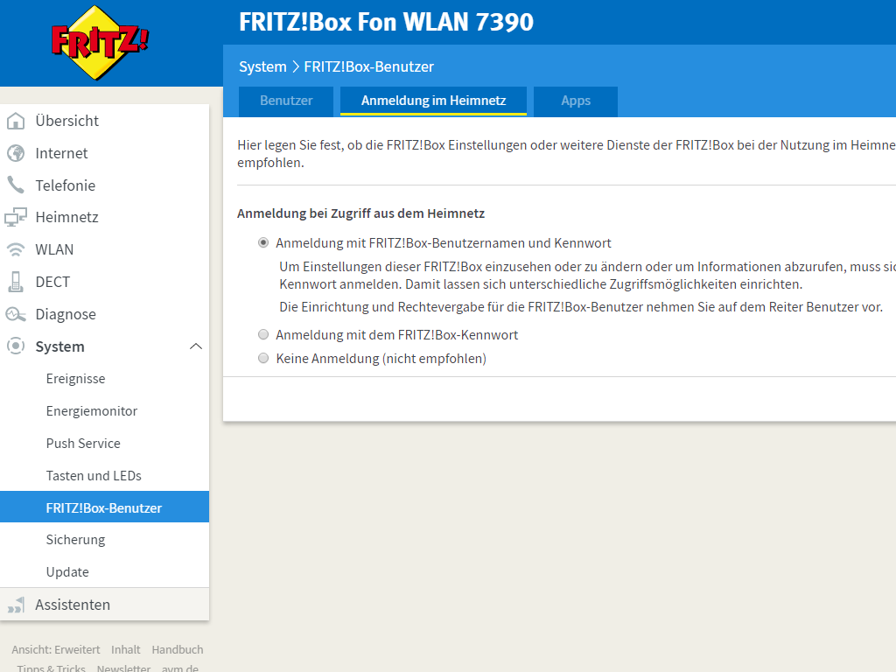

# node-red-contrib-fritzCallLog
This project is based on the work from https://github.com/lesander/fritzbox.js
It has been simplified to only support the desired functionality of this project

## Summary
This node-red node gives access to the Fritz!Box internal call log to all devices supporting the XSI interface.

## Getting Started
Get the latest version (`^7.0.0`) of nodejs and node-red
```
npm -g install node-red
```

Install this package
```
git clone https://github.com/mailsvb/node-red-contrib-fritzCallLog.git
cd node-red-contrib-fritzCallLog && npm -g install .
```

* Activate login via username and password on your Fritzbox
* use an existing account or create a new account with access to call log data
<p align="left">
  
  
</p>
